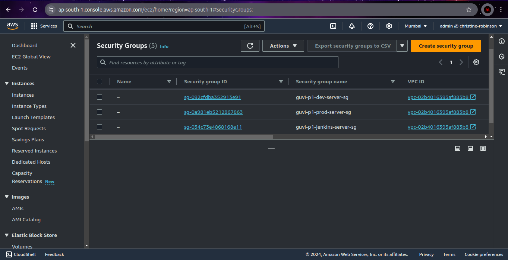

# Capstone Project Submission

## Links

- **GitHub Repository:**
  
  [https://github.com/christine-robinson/guvi-p1-reactjs-ecommerce-app](https://github.com/christine-robinson/guvi-p1-reactjs-ecommerce-app)

- **Deployed Site (Dev):**

  [http://52.66.250.157/](http://52.66.250.157/)

- **Deployed Site (Prod):**

  [http://43.204.230.254/](http://43.204.230.254/)

## Docker Images

- **Docker Image (Dev):**

  [christinerobinson101/guvi-p1-dev-reactjs-ecommerce-app](https://hub.docker.com/repository/docker/christinerobinson101/guvi-p1-dev-reactjs-ecommerce-app/tags)

- **Docker Image (Prod):**

  [christinerobinson101/guvi-p1-prod-reactjs-ecommerce-app](https://hub.docker.com/repository/docker/christinerobinson101/guvi-p1-prod-reactjs-ecommerce-app/tags)

## Screenshots

- **Jenkins:**

  

  

```groovy
pipeline {
    agent any

    triggers {
        githubPush()
    }

    stages {
        stage('Init') {
            steps {
                script {
                    // Set environment name based on git branch
                    switch(env.BRANCH_NAME) {
                        case 'main':
                            env.ENV = 'prod'
                            break;
                        case 'dev':
                            env.ENV = 'dev'
                            break;
                    }
                    
                    // Declare the IMAGE_REPO value
                    env.IMAGE_REPO = "christinerobinson101/guvi-p1-${env.ENV}-reactjs-ecommerce-app"

                    // Declare the IMAGE_TAG value (git short commit hash)
                    env.IMAGE_TAG = sh (script: 'git rev-parse --short HEAD', returnStdout: true)
                    
                    // Create .env file for deployment
                    def fileName = '.env'

                    def fileContent = "ENV=${env.ENV} \n"
                    fileContent += "DOCKER_IMAGE=${env.IMAGE_REPO}:${env.IMAGE_TAG} \n"

                    writeFile (file: fileName, text: fileContent)
                }

                // Executable permission for script files
                sh 'chmod +x *.sh'

                // Stash required files to deploy
                stash (name: 'deploy', includes: 'deploy.sh, docker-compose.yml, .env, monitoring/**/*')
            }
        }
        stage('Build') {
            steps {
                withCredentials([usernamePassword(credentialsId: 'docker-login-creds', passwordVariable: 'DOCKER_PASSWORD', usernameVariable: 'DOCKER_USERNAME')]) {
                    sh './build.sh $IMAGE_REPO $IMAGE_TAG'
                }
            }
        }
        stage('Deploy') {
            agent {
                label "${env.ENV}-server"
            }

            options {
                skipDefaultCheckout true
            }

            steps {
                cleanWs()
                unstash 'deploy'

                withCredentials([usernamePassword(credentialsId: 'docker-login-creds', passwordVariable: 'DOCKER_PASSWORD', usernameVariable: 'DOCKER_USERNAME')]) {
                    sh './deploy.sh'
                }
            }
        }
    }
}
```

- **AWS:**

  

  

  

  

  

- **Docker:**

  

  

- **Deployed Site:**

  

  

- **Monitoring:**

  

  

  

  

  

  

  

  
